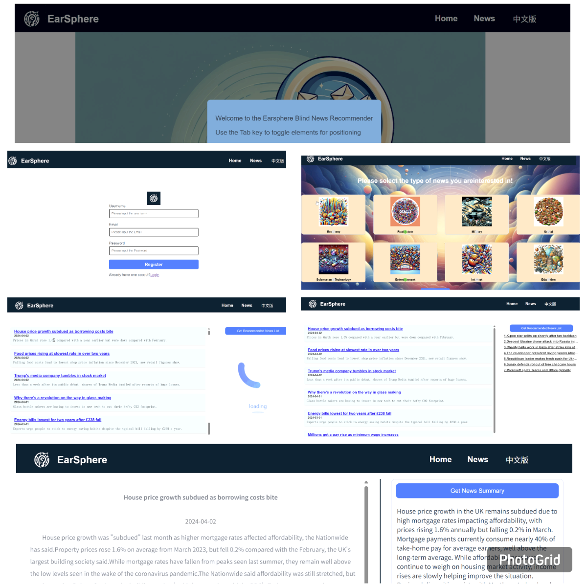

# LLM-Reading Aid-Visually Impaired
This is code implementation for the paper: LLM-Powered Reading Aid for Visually Impaired Online Learners

# 🔗 Paper &  Live Demo

- 📄 **Paper (Springer)**: [LLM-Powered Reading Aid for Visually Impaired Online Learners](https://link.springer.com/chapter/10.1007/978-981-97-9255-9_19)
- 🌐 **Live Demo**: http://101.201.40.89:8011/

# 📖 Introduction


LLM-ReadingAid-VisuallyImpaired is advanced intelligent reader system aimed at improving online extracurricular reading for visually impaired learners. Our system delivers personalized content recommendations and summaries based on users’ historical interests.

# 🖼️ Screenshots


# ⚡️ Getting Started

LLM-ReadingAid-VisuallyImpaired is build on gpt-series api, so please update your `API_KEY` in `LLM-ReadingAid-VisuallyImpaired\news_recommender_flask\config\config.ini`.

The code requires some dependencies as specified in `requirements.txt`. Please follow the relevant libraries to install or run:

```
pip install -r requirements.txt
```

# 🎉 Citation

If you find this code useful, please cite our project:

```
@software{LLM-InSightNews,
    title        = {LLM-Powered Reading Aid for Visually Impaired Online Learners},
    author       = {Zilin Li, Shaofei Shen, and Zhilong Xie},
    year         = 2024,
    journal      = {GitHub repository},
    publisher    = {GitHub},
    howpublished = {{https://github.com/shensf0522/LLM-InSightNews}}
}
```
# 🧡 Acknowledgements

Accessibility-first design for visually impaired learners

LLM-powered summarization & personalized recommendation

Thanks to all contributors and users for feedback!
